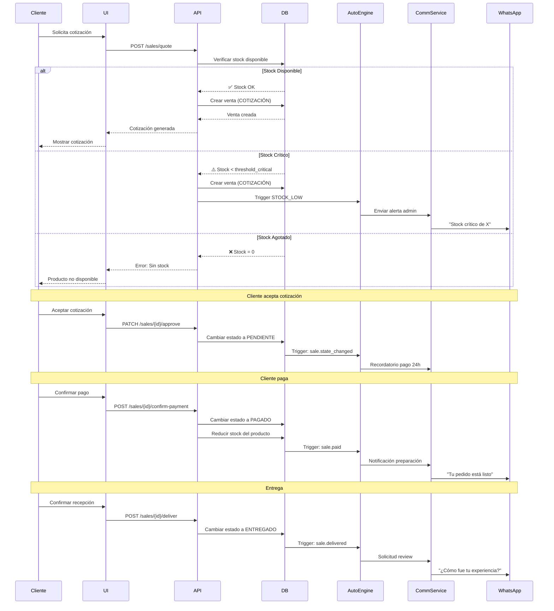
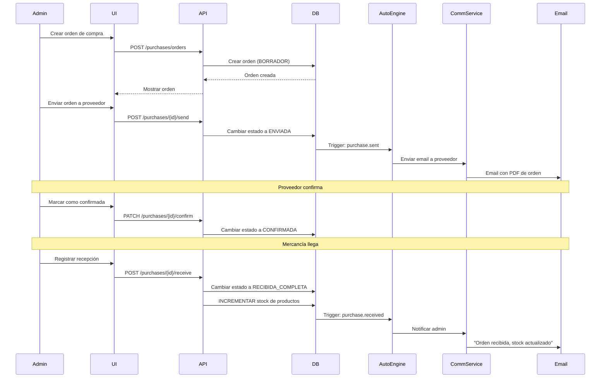
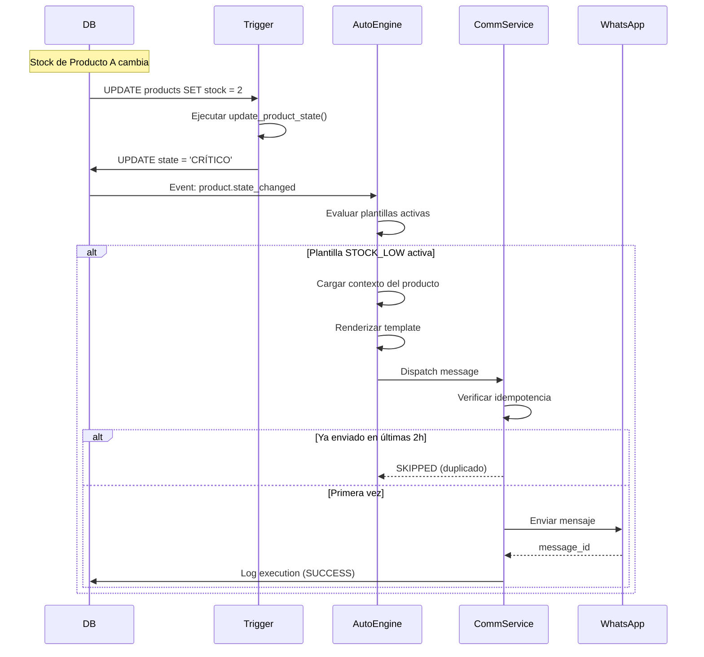
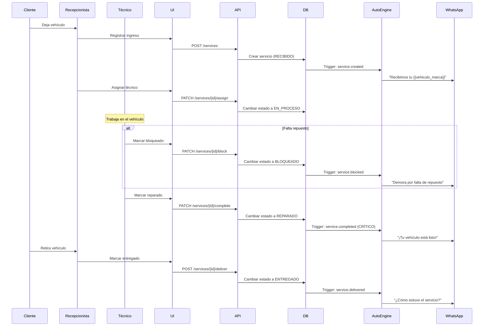
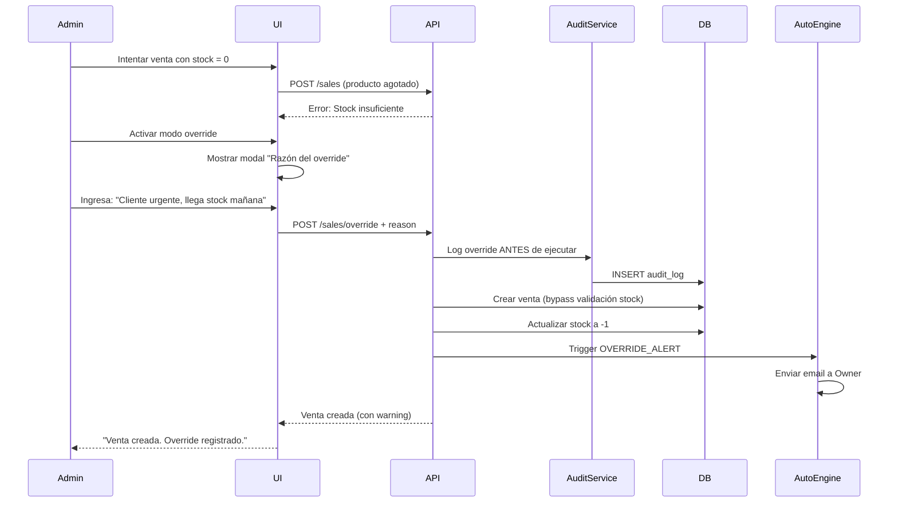

# 🔄 Flujos Operativos (BUSINESS_FLOWS.md)

> Define los flujos end-to-end de los procesos críticos del negocio, integrando estados, automatizaciones y comunicaciones.

---

## 📐 1. Principios de Flujos

### Reglas de Oro
1. **Event-Driven**: Todo flujo debe estar basado en eventos de dominio.
2. **Idempotencia**: Los flujos deben ser re-ejecutables sin duplicar acciones.
3. **Trazabilidad**: Cada paso debe registrarse en auditoría.
4. **Resiliencia**: Los flujos deben manejar fallos de proveedores externos.

### Anatomía de un Flujo
```typescript
interface BusinessFlow {
  trigger: DomainEvent;           // Qué inicia el flujo
  steps: FlowStep[];              // Pasos secuenciales
  automations: AutomationRule[];  // Comunicaciones automáticas
  error_handling: ErrorStrategy;  // Qué hacer si falla
  rollback: RollbackStrategy;     // Cómo deshacer cambios
}
```

---

## 🛒 2. FLUJO DE VENTA (Sales Flow)

### Diagrama Completo


### Paso a Paso Detallado

#### **Paso 1: Creación de Cotización**
```typescript
// Endpoint: POST /api/sales/quote
async createQuote(quoteData: CreateQuoteDTO) {
  // 1. Validar tenant
  if (quoteData.tenant_id !== currentUser.tenant_id) {
    throw new ForbiddenException('Cross-tenant access forbidden');
  }
  
  // 2. Verificar stock del producto
  const product = await this.productService.findById(quoteData.product_id);
  
  // 3. Evaluar estado del producto
  switch (product.state) {
    case 'AGOTADO':
      throw new BusinessRuleException(
        'PRODUCT_OUT_OF_STOCK',
        `Producto ${product.name} sin stock disponible`
      );
    
    case 'CRÍTICO':
      // Permitir cotización pero alertar
      await this.automationEngine.dispatch({
        template: 'STOCK_CRITICAL_ALERT',
        context: { 
          product_id: product.id,
          current_stock: product.stock 
        }
      });
      break;
    
    case 'BLOQUEADO':
      throw new BusinessRuleException(
        'PRODUCT_BLOCKED',
        `Producto ${product.name} bloqueado por calidad/fraude`
      );
  }
  
  // 4. Crear cotización
  const quote = await this.saleRepository.create({
    ...quoteData,
    state: 'COTIZACIÓN',
    created_by: currentUser.id
  });
  
  // 5. Registrar auditoría
  await this.auditService.log({
    action: 'QUOTE_CREATED',
    entity: 'sale',
    entity_id: quote.id,
    user_id: currentUser.id
  });
  
  return quote;
}
```

#### **Paso 2: Aprobación de Cotización**
```typescript
// Endpoint: PATCH /api/sales/{id}/approve
async approveSale(saleId: string) {
  // 1. Verificar estado actual
  const sale = await this.saleRepository.findById(saleId);
  if (sale.state !== 'COTIZACIÓN') {
    throw new InvalidStateTransitionException(
      `No se puede aprobar venta en estado ${sale.state}`
    );
  }
  
  // 2. Re-verificar stock (podría haber cambiado)
  const product = await this.productService.findById(sale.product_id);
  if (product.state === 'AGOTADO') {
    throw new BusinessRuleException('Stock agotado desde cotización');
  }
  
  // 3. Cambiar estado
  await this.saleRepository.update(saleId, { 
    state: 'PENDIENTE',
    approved_at: new Date()
  });
  
  // 4. Disparar automatización: Recordatorio de pago
  await this.automationEngine.dispatch({
    template: 'PAYMENT_REMINDER_24H',
    context: { sale_id: saleId },
    scheduled_for: new Date(Date.now() + 24 * 60 * 60 * 1000) // 24h
  });
  
  return { success: true };
}
```

#### **Paso 3: Confirmación de Pago**
```typescript
// Endpoint: POST /api/sales/{id}/confirm-payment
async confirmPayment(saleId: string, paymentData: PaymentConfirmDTO) {
  // 1. Verificar estado
  const sale = await this.saleRepository.findById(saleId);
  if (sale.state !== 'PENDIENTE') {
    throw new InvalidStateTransitionException();
  }
  
  // 2. Iniciar transacción de DB
  return await this.db.transaction(async (tx) => {
    // 3. Cambiar estado de venta
    await tx.sales.update(saleId, { 
      state: 'PAGADO',
      paid_at: new Date(),
      payment_method: paymentData.method
    });
    
    // 4. CRÍTICO: Reducir stock del producto
    const product = await tx.products.findById(sale.product_id);
    const newStock = product.stock - sale.quantity;
    
    if (newStock < 0) {
      throw new BusinessRuleException(
        'NEGATIVE_STOCK_PREVENTED',
        'No se permite stock negativo'
      );
    }
    
    await tx.products.update(product.id, { 
      stock: newStock 
    });
    // Trigger automático recalcula estado del producto
    
    // 5. Registrar movimiento de inventario
    await tx.inventory_movements.create({
      product_id: product.id,
      type: 'VENTA',
      quantity: -sale.quantity,
      reference_id: saleId,
      previous_stock: product.stock,
      new_stock: newStock
    });
    
    // 6. Disparar notificación al cliente
    await this.automationEngine.dispatch({
      template: 'ORDER_CONFIRMED',
      context: { 
        sale_id: saleId,
        customer_name: sale.customer.name,
        total: sale.total
      }
    });
    
    return { success: true };
  });
}
```

### Manejo de Errores del Flujo

#### **Error 1: Stock Insuficiente Durante Pago**
```typescript
try {
  await confirmPayment(saleId, paymentData);
} catch (error) {
  if (error.code === 'NEGATIVE_STOCK_PREVENTED') {
    // 1. Revertir estado de venta
    await saleRepository.update(saleId, { 
      state: 'CANCELADA',
      cancelled_reason: 'Stock agotado durante proceso de pago'
    });
    
    // 2. Notificar al cliente
    await automationEngine.dispatch({
      template: 'SALE_CANCELLED_NO_STOCK',
      context: { sale_id: saleId }
    });
    
    // 3. Alertar al admin
    await automationEngine.dispatch({
      template: 'ADMIN_RACE_CONDITION_ALERT',
      context: { 
        issue: 'Stock agotado entre cotización y pago',
        sale_id: saleId
      }
    });
  }
}
```

---

## 📦 3. FLUJO DE COMPRA (Purchase Flow)

### Diagrama Completo


### Paso a Paso Detallado

#### **Paso 1: Registro de Recepción**
```typescript
// Endpoint: POST /api/purchases/{id}/receive
async receiveOrder(orderId: string, receiptData: ReceiptDTO) {
  return await this.db.transaction(async (tx) => {
    // 1. Verificar estado
    const order = await tx.purchase_orders.findById(orderId);
    if (order.state !== 'CONFIRMADA' && order.state !== 'RECIBIDA_PARCIAL') {
      throw new InvalidStateTransitionException();
    }
    
    // 2. Validar cantidades
    const totalReceived = receiptData.items.reduce((sum, item) => 
      sum + item.quantity_received, 0
    );
    const totalOrdered = order.items.reduce((sum, item) => 
      sum + item.quantity, 0
    );
    
    const isPartial = totalReceived < totalOrdered;
    const newState = isPartial ? 'RECIBIDA_PARCIAL' : 'RECIBIDA_COMPLETA';
    
    // 3. Actualizar orden
    await tx.purchase_orders.update(orderId, {
      state: newState,
      received_at: new Date()
    });
    
    // 4. CRÍTICO: Actualizar stock de cada producto
    for (const item of receiptData.items) {
      const product = await tx.products.findById(item.product_id);
      const newStock = product.stock + item.quantity_received;
      
      await tx.products.update(product.id, { 
        stock: newStock 
      });
      // El trigger recalcula automáticamente el estado del producto
      
      // 5. Registrar movimiento de inventario
      await tx.inventory_movements.create({
        product_id: product.id,
        type: 'COMPRA',
        quantity: item.quantity_received,
        reference_id: orderId,
        previous_stock: product.stock,
        new_stock: newStock
      });
    }
    
    // 6. Disparar notificación si orden completa
    if (newState === 'RECIBIDA_COMPLETA') {
      await this.automationEngine.dispatch({
        template: 'PURCHASE_COMPLETED',
        context: { order_id: orderId }
      });
    }
    
    return { success: true, state: newState };
  });
}
```

---

## 🚨 4. FLUJO DE ALERTA DE STOCK CRÍTICO (Stock Alert Flow)

### Diagrama Completo


### Implementación del Trigger

#### **Trigger en Supabase**
```sql
-- Trigger que detecta cambios de estado críticos
CREATE OR REPLACE FUNCTION notify_state_change()
RETURNS TRIGGER AS $$
BEGIN
  -- Solo disparar si el estado cambió
  IF NEW.state != OLD.state THEN
    -- Insertar evento en tabla de eventos
    INSERT INTO domain_events (
      event_type,
      entity_type,
      entity_id,
      payload,
      created_at
    ) VALUES (
      'product.state_changed',
      'product',
      NEW.id,
      jsonb_build_object(
        'old_state', OLD.state,
        'new_state', NEW.state,
        'product_name', NEW.name,
        'current_stock', NEW.stock,
        'tenant_id', NEW.tenant_id
      ),
      NOW()
    );
  END IF;
  
  RETURN NEW;
END;
$$ LANGUAGE plpgsql;

CREATE TRIGGER product_state_change_trigger
AFTER UPDATE OF state ON products
FOR EACH ROW
EXECUTE FUNCTION notify_state_change();
```

#### **Procesador de Eventos (NestJS)**
```typescript
@Injectable()
export class DomainEventProcessor {
  @Cron('*/30 * * * * *') // Cada 30 segundos
  async processEvents() {
    // 1. Obtener eventos no procesados
    const events = await this.db.domain_events.findMany({
      where: { processed: false },
      orderBy: { created_at: 'asc' },
      limit: 100
    });
    
    for (const event of events) {
      try {
        // 2. Enviar al Automation Engine
        await this.automationEngine.handleEvent(event);
        
        // 3. Marcar como procesado
        await this.db.domain_events.update(event.id, { 
          processed: true,
          processed_at: new Date()
        });
      } catch (error) {
        // 4. Log de error pero continuar
        await this.db.domain_events.update(event.id, {
          processing_failed: true,
          error_message: error.message
        });
      }
    }
  }
}
```

---

## 🔧 5. FLUJO DE SERVICIO - TALLER MECÁNICO (Service Flow)

### Diagrama Completo


### Regla Crítica: Notificación de Vehículo Listo

```typescript
// Esta es LA automatización más importante del taller
const VEHICLE_READY_AUTOMATION = {
  name: 'Notificación Vehículo Listo',
  trigger: 'service.state_changed',
  condition: (event) => event.payload.new_state === 'REPARADO',
  priority: 'CRITICAL',
  channel: 'whatsapp',
  
  handler: async (event) => {
    const service = await db.services.findById(event.entity_id);
    const customer = await db.customers.findById(service.customer_id);
    const vehicle = await db.vehicles.findById(service.vehicle_id);
    
    // Renderizar mensaje
    const message = template.render(TEMPLATES.VEHICLE_READY, {
      cliente_nombre: customer.name,
      vehiculo_marca: vehicle.brand,
      vehiculo_modelo: vehicle.model,
      vehiculo_placa: vehicle.plate,
      servicio_costo: service.total_cost,
      negocio_nombre: service.tenant.business_name
    });
    
    // Enviar inmediatamente (no agendar)
    await commService.send({
      channel: 'whatsapp',
      to: customer.phone,
      message: message,
      context: { service_id: service.id }
    });
    
    // Si no hay respuesta en 24h, reenviar
    await this.scheduleFollowUp(service.id, 24);
  }
};
```

---

## ⏱️ 6. FLUJO DE TIMEOUT Y RECORDATORIOS (Scheduled Automations)

### Diagrama de Recordatorios
```mermaid
gantt
    title Automatizaciones Programadas
    dateFormat  HH:mm
    section Venta Pendiente
    Creación venta          :done, 00:00, 1m
    Recordatorio 24h        :crit, 24:00, 1m
    Recordatorio 48h        :48:00, 1m
    Cancelación automática  :72:00, 1m
    
    section Servicio Reparado
    Marca como REPARADO     :done, 00:00, 1m
    Notificación inmediata  :crit, 00:00, 1m
    Recordatorio 24h        :24:00, 1m
    Alerta demora 72h       :72:00, 1m
```

### Implementación de Cron Jobs

```typescript
@Injectable()
export class ScheduledAutomationsService {
  
  // Recordatorio de pagos pendientes (cada 6 horas)
  @Cron('0 */6 * * *')
  async sendPaymentReminders() {
    const pendingSales = await this.db.sales.findMany({
      where: {
        state: 'PENDIENTE',
        created_at: {
          gte: new Date(Date.now() - 48 * 60 * 60 * 1000), // Últimas 48h
          lte: new Date(Date.now() - 24 * 60 * 60 * 1000)  // Hace más de 24h
        }
      }
    });
    
    for (const sale of pendingSales) {
      await this.automationEngine.dispatch({
        template: 'PAYMENT_REMINDER',
        context: { sale_id: sale.id },
        idempotency_key: `payment_reminder_${sale.id}_${format(new Date(), 'yyyy-MM-dd')}`
      });
    }
  }
  
  // Cancelar cotizaciones vencidas (diario a medianoche)
  @Cron('0 0 * * *')
  async cancelExpiredQuotes() {
    await this.db.sales.updateMany({
      where: {
        state: 'COTIZACIÓN',
        created_at: { lt: new Date(Date.now() - 7 * 24 * 60 * 60 * 1000) }
      },
      data: {
        state: 'CANCELADA',
        cancelled_reason: 'TIMEOUT_7_DAYS',
        cancelled_at: new Date()
      }
    });
  }
  
  // Alertar vehículos reparados hace más de 3 días (cada 12h)
  @Cron('0 */12 * * *')
  async alertDelayedPickups() {
    const delayedServices = await this.db.services.findMany({
      where: {
        state: 'REPARADO',
        updated_at: { lt: new Date(Date.now() - 72 * 60 * 60 * 1000) }
      }
    });
    
    for (const service of delayedServices) {
      await this.automationEngine.dispatch({
        template: 'ADMIN_DELAYED_PICKUP',
        context: { 
          service_id: service.id,
          hours_delayed: Math.floor(
            (Date.now() - service.updated_at.getTime()) / (60 * 60 * 1000)
          )
        }
      });
    }
  }
}
```

---

## 🔄 7. FLUJO DE OVERRIDE CON AUDITORÍA (Override Flow)

### Diagrama de Override


### Implementación del Override

```typescript
@Post('sales/override')
@RequireRole('admin', 'owner')
@AuditAction('FORCE_SALE_NO_STOCK')
async createSaleWithOverride(
  @Body() saleData: CreateSaleDTO,
  @Body('override_reason') reason: string,
  @User() user: UserEntity
) {
  // 1. CRÍTICO: Validar que la razón no esté vacía
  if (!reason || reason.trim().length < 10) {
    throw new BadRequestException(
      'Override requiere razón detallada (mínimo 10 caracteres)'
    );
  }
  
  // 2. Registrar intención ANTES de ejecutar (inmutable)
  const auditEntry = await this.auditService.logOverride({
    action: 'FORCE_SALE_NO_STOCK',
    user_id: user.id,
    user_role: user.role,
    reason: reason,
    context: {
      product_id: saleData.product_id,
      customer_id: saleData.customer_id,
      quantity: saleData.quantity
    },
    timestamp: new Date(),
    ip_address: request.ip
  });
  
  // 3. Ejecutar venta sin validación de stock
  const sale = await this.salesService.createWithoutStockValidation(saleData);
  
  // 4. ALERTA CRÍTICA al Owner
  await this.automationEngine.dispatch({
    template: 'OWNER_OVERRIDE_ALERT',
    priority: 'HIGH',
    context: {
      admin_name: user.name,
      action: 'Venta sin stock',
      reason: reason,
      product_name: sale.product.name,
      current_stock: sale.product.stock,
      audit_id: auditEntry.id
    }
  });
  
  // 5. Marcar la venta como "override" para reportes
  await this.saleRepository.update(sale.id, {
    is_override: true,
    override_audit_id: auditEntry.id
  });
  
  return {
    sale,
    warning: 'Venta creada con override. Stock actual es negativo.',
    audit_id: auditEntry.id
  };
}
```

---

## 📊 8. Monitoreo de Flujos (Flow Health)

### Dashboard de Estado de Flujos
```typescript
interface FlowHealthDashboard {
  sales_flow: {
    active_quotes: number;
    pending_payments: number;
    abandoned_carts: number; // Cotizaciones > 3 días sin respuesta
    avg_conversion_time: number; // Tiempo promedio cotización → pago
  };
  purchase_flow: {
    pending_orders: number;
    delayed_deliveries: number; // Órdenes confirmadas hace > 7 días
  };
  service_flow: {
    vehicles_waiting_pickup: number; // Estado REPARADO
    delayed_repairs: number; // EN_PROCESO > 48h
  };
  automation_flow: {
    pending_executions: number;
    failed_last_24h: number;
    success_rate: number;
  };
}
```

### Alertas de Salud de Flujos
```typescript
const FLOW_HEALTH_ALERTS = [
  {
    name: 'Abandono de Cotizaciones Alto',
    condition: 'abandoned_carts > 10',
    action: 'NOTIFY_SALES_MANAGER',
    message: 'Más de 10 cotizaciones abandonadas esta semana'
  },
  {
    name: 'Vehículos Esperando Retiro',
    condition: 'vehicles_waiting_pickup > 5',
    action: 'ESCALATE_TO_OWNER',
    message: '5+ vehículos listos sin retirar'
  },
  {
    name: 'Fallo Crítico de Automatizaciones',
    condition: 'automation_success_rate < 0.95',
    action: 'PAGE_DEVOPS',
    message: 'Tasa de éxito de automatizaciones < 95%'
  }
];
```

---

## 🎯 9. Casos de Uso Complejos

### Caso 1: Race Condition en Venta Simultánea
**Escenario**: Dos vendedores intentan vender el último producto al mismo tiempo.

```typescript
// Solución: Row-level locking en PostgreSQL
async createSale(saleData: CreateSaleDTO) {
  return await this.db.transaction(async (tx) => {
    // 1. Bloquear la fila del producto (SELECT FOR UPDATE)
    const product = await tx.query(
      'SELECT * FROM products WHERE id = $1 FOR UPDATE',
      [saleData.product_id]
    );
    
    // 2. Verificar stock con la fila bloqueada
    if (product.stock < saleData.quantity) {
      throw new BusinessRuleException('Stock insuficiente');
    }
    
    // 3. Crear venta
    const sale = await tx.sales.create(saleData);
    
    // 4. Reducir stock
    await tx.products.update(product.id, {
      stock: product.stock - saleData.quantity
    });
    
    return sale;
  });
}
```

### Caso 2: Rollback de Venta por Pago Rechazado
**Escenario**: La pasarela de pagos rechaza el pago después de reducir el stock.

```typescript
async handlePaymentRejection(saleId: string, rejectionData: any) {
  return await this.db.transaction(async (tx) => {
    // 1. Cambiar estado de venta
    await tx.sales.update(saleId, {
      state: 'RECHAZADO',
      rejection_reason: rejectionData.reason,
      rejected_at: new Date()
    });
    
    // 2. CRÍTICO: Devolver stock
    const sale = await tx.sales.findById(saleId);
    const product = await tx.products.findById(sale.product_id);
    
    await tx.products.update(product.id, {
      stock: product.stock + sale.quantity
    });
    
    // 3. Registrar movimiento de reversión
    await tx.inventory_movements.create({
      product_id: product.id,
      type: 'REVERSA_VENTA',
      quantity: sale.quantity,
      reference_id: saleId,
      previous_stock: product.stock,
      new_stock: product.stock + sale.quantity
    });
    
    // 4. Notificar al cliente
    await this.automationEngine.dispatch({
      template: 'PAYMENT_REJECTED',
      context: { 
        sale_id: saleId,
        reason: rejectionData.reason
      }
    });
    
    return { success: true };
  });
}
```

---

## 📚 Referencias

### Documentos Relacionados
- [DOMAIN_STATES.md](./DOMAIN_STATES.md) - Estados usados en estos flujos
- [PERMISSIONS_MATRIX.md](./PERMISSIONS_MATRIX.md) - Roles requeridos para cada paso
- [AUTOMATION_ENGINE.md](./AUTOMATION_ENGINE.md) - Motor que ejecuta las notificaciones

### Implementación Técnica
- **Supabase Functions**: Para triggers de DB
- **NestJS Cron**: Para trabajos programados
- **Bull Queue**: Para procesamiento asíncrono de eventos

---

**Estado**: ✅ **Flujos Operativos Definidos**  
**Versión**: 1.0.0  
**Última Actualización**: 2026-02-13  
**Mantenedor**: Smart Business OS Core Team
