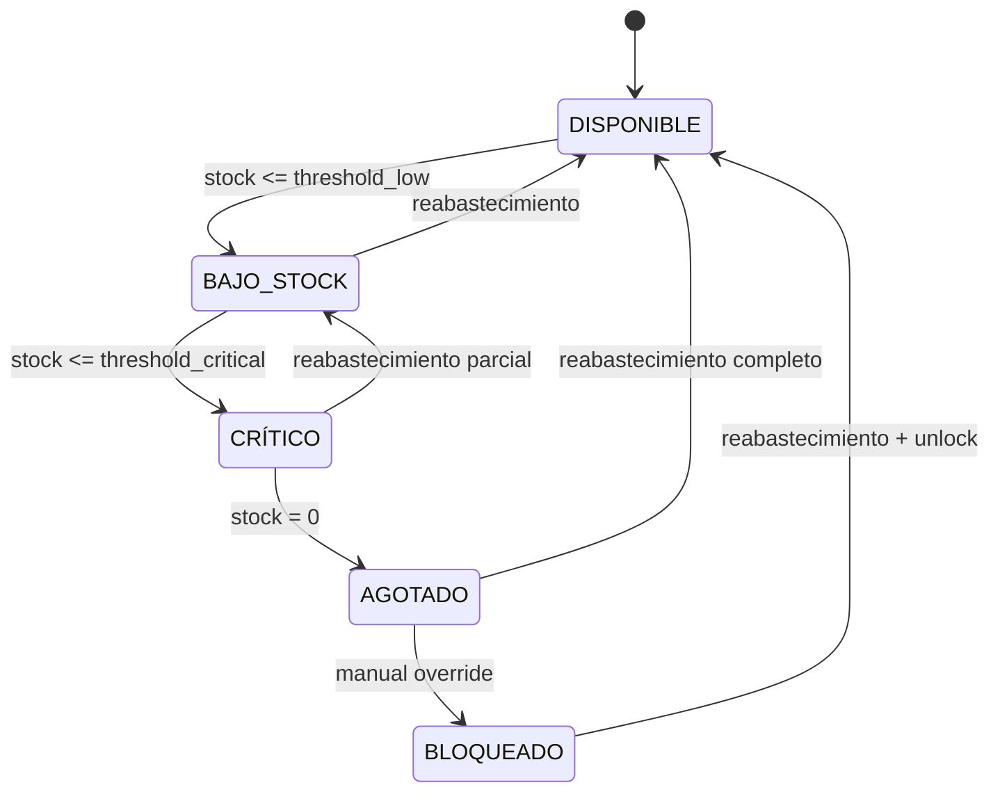
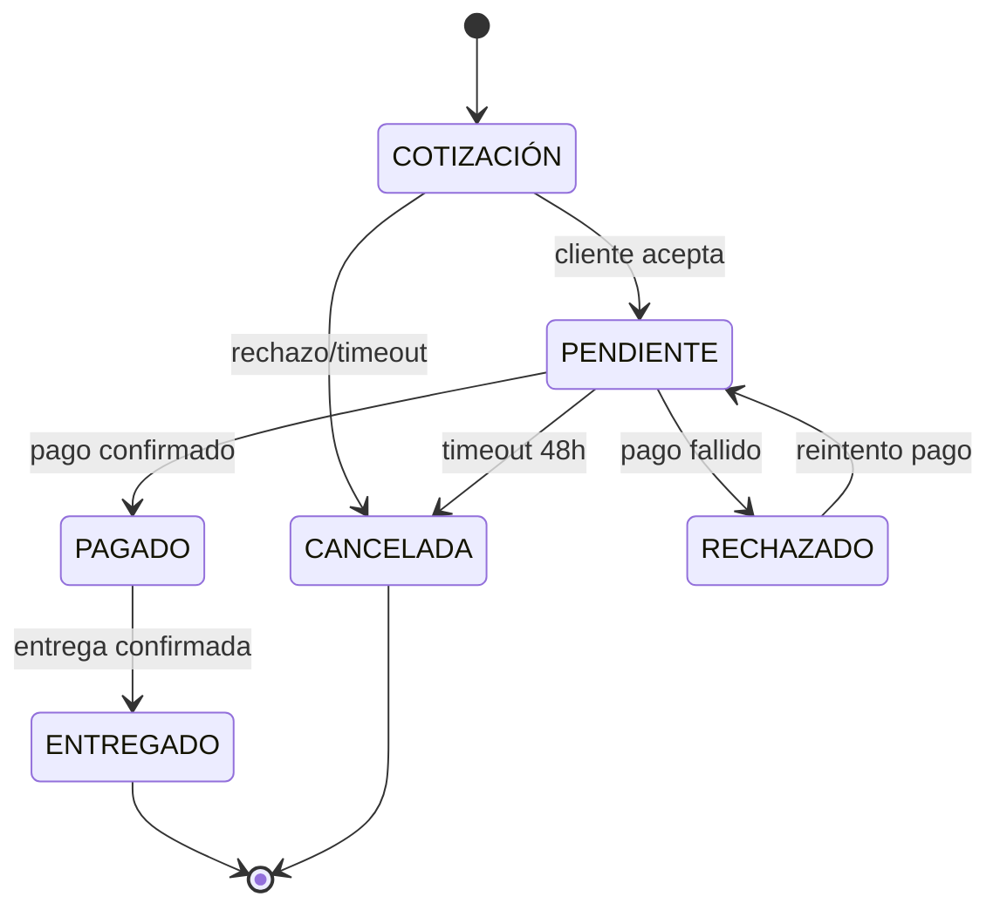
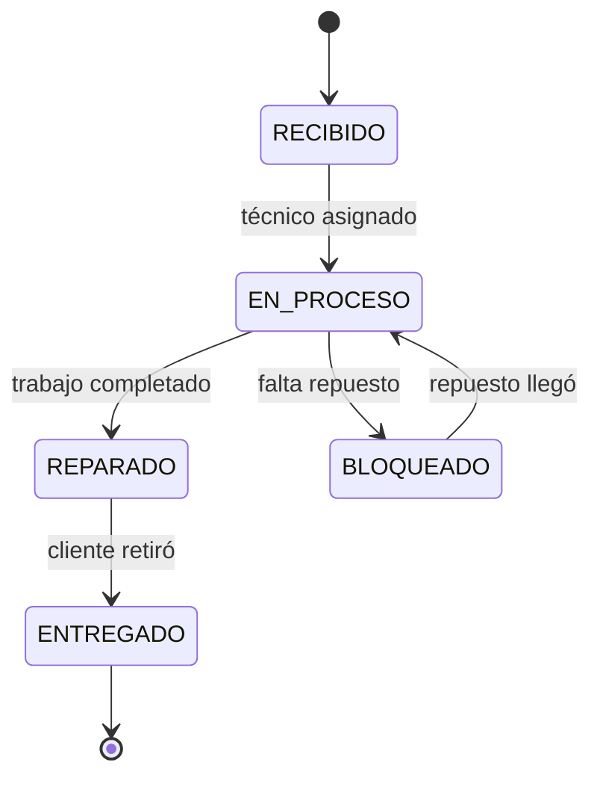
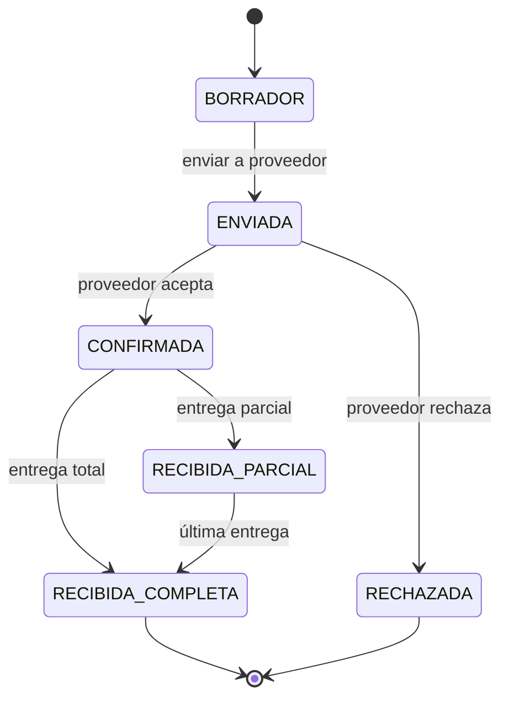

# 🔄 Estados de Dominio (DOMAIN_STATES.md)

> Define los estados válidos de cada entidad de negocio, sus transiciones permitidas y las reglas de bloqueo de acciones.

---

## 📐 1. Principios de Estados

### Reglas de Oro
1. **Estado Explícito**: Cada entidad debe tener un estado claro en todo momento.
2. **Transiciones Auditadas**: Todo cambio de estado debe registrarse en `audit_log`.
3. **Bloqueos Preventivos**: Ciertos estados impiden acciones (ej: no vender con stock agotado).
4. **Override Controlado**: Solo roles autorizados pueden forzar transiciones prohibidas.

### Arquitectura de Estados
```typescript
interface DomainState {
  entity: string;           // Producto, Venta, Servicio
  current_state: string;    // Estado actual
  allowed_next: string[];   // Estados válidos siguientes
  blocked_actions: string[];// Acciones prohibidas en este estado
  required_role: string[];  // Roles que pueden forzar transición
}
```

---

## 📦 2. Estados de PRODUCTO (Inventory)

### Diagrama de Estados


### Definición de Estados

| Estado | Condición | Health Score | Acciones Permitidas | Acciones Bloqueadas |
|--------|-----------|--------------|---------------------|---------------------|
| **DISPONIBLE** | `stock > threshold_low` | 🟢 SALUDABLE | Venta, Cotización, Edición | Ninguna |
| **BAJO_STOCK** | `stock <= threshold_low && stock > threshold_critical` | 🟡 ADVERTENCIA | Venta, Cotización | Ninguna (dispara alerta) |
| **CRÍTICO** | `stock <= threshold_critical && stock > 0` | 🟠 CRÍTICO | Solo Cotización | Venta directa (requiere override) |
| **AGOTADO** | `stock = 0` | 🔴 CRÍTICO | Solo Orden de Compra | Venta, Cotización |
| **BLOQUEADO** | Manual (fraude, calidad) | ⛔ BLOQUEADO | Solo visualización | Toda transacción |

### Umbrales por Defecto
```typescript
const DEFAULT_THRESHOLDS = {
  threshold_low: 10,      // Alerta temprana
  threshold_critical: 3   // Acción urgente
};
```

### Reglas de Transición

#### ✅ Transiciones Automáticas (Supabase Trigger)
```sql
-- Al actualizar stock, recalcular estado
CREATE OR REPLACE FUNCTION update_product_state()
RETURNS TRIGGER AS $$
BEGIN
  IF NEW.stock = 0 THEN
    NEW.state = 'AGOTADO';
  ELSIF NEW.stock <= NEW.threshold_critical THEN
    NEW.state = 'CRÍTICO';
  ELSIF NEW.stock <= NEW.threshold_low THEN
    NEW.state = 'BAJO_STOCK';
  ELSE
    NEW.state = 'DISPONIBLE';
  END IF;
  RETURN NEW;
END;
$$ LANGUAGE plpgsql;
```

#### ⚠️ Override Manual (con Auditoría)
```typescript
// Solo Owner/Admin pueden forzar venta con stock crítico
async function forceProductSale(productId: string, userId: string, reason: string) {
  // 1. Verificar rol
  if (!hasRole(userId, ['owner', 'admin'])) {
    throw new Error('FORBIDDEN: Override requiere rol admin');
  }
  
  // 2. Registrar auditoría ANTES de la acción
  await auditLog.create({
    action: 'FORCE_SALE_CRITICAL_STOCK',
    user_id: userId,
    resource: `product:${productId}`,
    reason: reason,
    timestamp: new Date()
  });
  
  // 3. Permitir transacción
  return true;
}
```

---

## 💰 3. Estados de VENTA (Sales)

### Diagrama de Estados


### Definición de Estados

| Estado | Significado | Acciones Permitidas | Dispara Automation |
|--------|-------------|---------------------|-------------------|
| **COTIZACIÓN** | Propuesta sin compromiso | Editar, Aprobar, Cancelar | NO |
| **PENDIENTE** | Esperando pago | Confirmar Pago, Cancelar | ✅ Recordatorio 24h |
| **PAGADO** | Pago confirmado, preparando envío | Marcar Entregado | ✅ Notificación preparación |
| **ENTREGADO** | Transacción completa | Solo lectura | ✅ Solicitud review |
| **RECHAZADO** | Pago fallido | Reintentar, Cancelar | ✅ Alerta admin |
| **CANCELADA** | Transacción abortada | Solo lectura | NO |

### Reglas de Negocio

#### 🔒 Bloqueos por Estado
```typescript
const SALES_ACTION_MATRIX = {
  COTIZACIÓN: {
    allow: ['edit', 'approve', 'cancel'],
    block: ['mark_paid', 'mark_delivered']
  },
  PENDIENTE: {
    allow: ['confirm_payment', 'cancel'],
    block: ['edit', 'mark_delivered']
  },
  PAGADO: {
    allow: ['mark_delivered'],
    block: ['edit', 'cancel', 'confirm_payment']
  },
  ENTREGADO: {
    allow: ['view'],
    block: ['edit', 'cancel', 'confirm_payment', 'mark_delivered']
  }
};
```

#### ⏱️ Timeout Automático
```typescript
// Cancelar cotizaciones no aceptadas en 7 días
cron.schedule('0 0 * * *', async () => {
  await db.sales.updateMany({
    where: {
      state: 'COTIZACIÓN',
      created_at: { lt: new Date(Date.now() - 7 * 24 * 60 * 60 * 1000) }
    },
    data: { state: 'CANCELADA', cancelled_reason: 'TIMEOUT' }
  });
});
```

---

## 🔧 4. Estados de SERVICIO (Taller Mecánico)

### Diagrama de Estados


### Definición de Estados

| Estado | Significado | Dispara Automation | Tiempo Máximo |
|--------|-------------|-------------------|---------------|
| **RECIBIDO** | Vehículo ingresó al taller | ✅ Confirmación recepción WhatsApp | - |
| **EN_PROCESO** | Técnico trabajando | NO | 48h (alerta) |
| **BLOQUEADO** | Esperando repuesto externo | ✅ Notificación demora | - |
| **REPARADO** | Listo para retirar | ✅ **Notificación WhatsApp crítica** | 72h (alerta) |
| **ENTREGADO** | Cliente retiró vehículo | ✅ Solicitud calificación | - |

### Reglas de Automatización

#### 🚨 Alerta Crítica: Vehículo Reparado
```typescript
// Plantilla de automatización más importante del taller
const TEMPLATE_VEHICLE_READY = {
  trigger: 'service.state_changed',
  condition: { new_state: 'REPARADO' },
  channel: 'whatsapp',
  template: `
    Hola {{cliente_nombre}}, 
    tu {{vehiculo_marca}} {{vehiculo_modelo}} ({{vehiculo_placa}}) 
    ya está listo para ser retirado en {{negocio_nombre}}.
    
    Costo final: ${{servicio_costo}}
    Horario: Lunes a Sábado, 8am - 6pm
  `,
  priority: 'HIGH'
};
```

#### ⏱️ Alerta de Demora
```typescript
// Si un servicio está más de 48h en EN_PROCESO, alertar admin
cron.schedule('0 */6 * * *', async () => {
  const delayedServices = await db.services.findMany({
    where: {
      state: 'EN_PROCESO',
      updated_at: { lt: new Date(Date.now() - 48 * 60 * 60 * 1000) }
    }
  });
  
  for (const service of delayedServices) {
    await automationEngine.dispatch({
      template: 'ADMIN_SERVICE_DELAYED',
      context: { service_id: service.id, hours_delayed: 48 }
    });
  }
});
```

---

## 🛒 5. Estados de ORDEN DE COMPRA (Purchase Orders)

### Diagrama de Estados


### Definición de Estados

| Estado | Acciones Permitidas | Actualiza Stock | Dispara Automation |
|--------|---------------------|-----------------|-------------------|
| **BORRADOR** | Editar, Enviar, Eliminar | NO | NO |
| **ENVIADA** | Solo lectura | NO | ✅ Email a proveedor |
| **CONFIRMADA** | Marcar Recibida | NO (hasta recepción) | NO |
| **RECIBIDA_PARCIAL** | Registrar más entregas | ✅ Sí (cantidad parcial) | NO |
| **RECIBIDA_COMPLETA** | Solo lectura | ✅ Sí (total) | ✅ Notificación admin |
| **RECHAZADA** | Solo lectura | NO | ✅ Alerta buscar alternativa |

---

## 🎯 6. Matriz de Health Score Global

El **Health Score** es un indicador agregado del estado del negocio basado en el estado de sus productos.

### Cálculo del Score
```typescript
function calculateTenantHealthScore(tenantId: string): HealthScore {
  const products = await db.products.findMany({ where: { tenant_id: tenantId } });
  
  const counts = {
    DISPONIBLE: 0,
    BAJO_STOCK: 0,
    CRÍTICO: 0,
    AGOTADO: 0,
    BLOQUEADO: 0
  };
  
  products.forEach(p => counts[p.state]++);
  
  // Fórmula de Health Score
  const total = products.length;
  const score = (
    (counts.DISPONIBLE * 1.0) +
    (counts.BAJO_STOCK * 0.7) +
    (counts.CRÍTICO * 0.3) +
    (counts.AGOTADO * 0.0) +
    (counts.BLOQUEADO * -0.5)
  ) / total;
  
  if (score >= 0.8) return { level: 'SALUDABLE', color: 'green', icon: '🟢' };
  if (score >= 0.5) return { level: 'ADVERTENCIA', color: 'yellow', icon: '🟡' };
  if (score >= 0.2) return { level: 'CRÍTICO', color: 'orange', icon: '🟠' };
  return { level: 'EMERGENCIA', color: 'red', icon: '🔴' };
}
```

### Restricciones por Health Score

| Health Score | Acciones Bloqueadas | Automatizaciones Disparadas |
|--------------|---------------------|----------------------------|
| 🟢 SALUDABLE | Ninguna | Ninguna |
| 🟡 ADVERTENCIA | Ninguna | Reporte semanal |
| 🟠 CRÍTICO | Facturación masiva (requiere override) | Alerta diaria |
| 🔴 EMERGENCIA | Ventas, Facturación | **Bloqueo total + Alerta CEO** |

---

## 🔐 7. Auditoría de Cambios de Estado

### Tabla de Auditoría
```sql
CREATE TABLE state_audit_log (
    id UUID PRIMARY KEY DEFAULT gen_random_uuid(),
    tenant_id UUID NOT NULL,
    entity_type VARCHAR(50) NOT NULL,  -- 'product', 'sale', 'service'
    entity_id UUID NOT NULL,
    old_state VARCHAR(50) NOT NULL,
    new_state VARCHAR(50) NOT NULL,
    triggered_by UUID,  -- user_id
    trigger_type VARCHAR(50),  -- 'manual', 'automatic', 'override'
    reason TEXT,
    metadata JSONB,
    created_at TIMESTAMP DEFAULT NOW()
);

-- Índice para consultas rápidas
CREATE INDEX idx_state_audit_entity ON state_audit_log(entity_type, entity_id);
CREATE INDEX idx_state_audit_tenant ON state_audit_log(tenant_id, created_at DESC);
```

### Hook de Auditoría Automática
```typescript
// Interceptor en NestJS para auditar todos los cambios de estado
@Injectable()
export class StateAuditInterceptor implements NestInterceptor {
  async intercept(context: ExecutionContext, next: CallHandler) {
    const request = context.switchToHttp().getRequest();
    const { entity, oldState, newState } = request.body;
    
    // Ejecutar acción
    const result = await next.handle().toPromise();
    
    // Registrar cambio
    await this.auditService.logStateChange({
      entity_type: entity.type,
      entity_id: entity.id,
      old_state: oldState,
      new_state: newState,
      triggered_by: request.user.id,
      trigger_type: request.user.role === 'admin' ? 'override' : 'manual'
    });
    
    return result;
  }
}
```

---

## 📊 8. Monitoreo y Alertas

### Dashboard de Estados (Vista Admin)
```typescript
interface StatesDashboard {
  products: {
    DISPONIBLE: number;
    BAJO_STOCK: number;
    CRÍTICO: number;
    AGOTADO: number;
    BLOQUEADO: number;
  };
  sales: {
    COTIZACIÓN: number;
    PENDIENTE: number;
    PAGADO: number;
  };
  services: {
    RECIBIDO: number;
    EN_PROCESO: number;
    REPARADO: number;  // ⚠️ Este es crítico (cliente esperando)
  };
  health_score: HealthScore;
}
```

### Alertas Automáticas
```typescript
const CRITICAL_ALERTS = [
  {
    condition: 'product.state = AGOTADO AND is_best_seller = true',
    action: 'NOTIFY_ADMIN',
    message: 'Producto estrella agotado: {{product_name}}'
  },
  {
    condition: 'service.state = REPARADO AND hours_waiting > 72',
    action: 'ESCALATE_TO_OWNER',
    message: 'Vehículo listo hace 3 días sin retirar: {{vehicle_plate}}'
  },
  {
    condition: 'tenant.health_score = EMERGENCIA',
    action: 'BLOCK_OPERATIONS + NOTIFY_CEO',
    message: 'Operaciones bloqueadas por inventario crítico'
  }
];
```

---

## 🎯 9. Casos de Uso Críticos

### Caso 1: Bloqueo de Venta por Stock Agotado
```typescript
// Service Layer
async createSale(saleData: CreateSaleDTO) {
  const product = await this.productService.findById(saleData.product_id);
  
  // ❌ Bloqueo automático
  if (product.state === 'AGOTADO') {
    throw new BusinessRuleException(
      'SALE_BLOCKED_NO_STOCK',
      `Producto ${product.name} sin stock disponible`
    );
  }
  
  // ⚠️ Advertencia pero permitido
  if (product.state === 'CRÍTICO') {
    await this.auditService.logWarning({
      action: 'SALE_WITH_CRITICAL_STOCK',
      product_id: product.id,
      current_stock: product.stock
    });
  }
  
  // ✅ Continuar venta
  return this.saleRepository.create(saleData);
}
```

### Caso 2: Override Autorizado con Auditoría
```typescript
// Controller Layer
@Post('sales/override')
@RequireRole('admin', 'owner')
async createSaleOverride(
  @Body() saleData: CreateSaleDTO,
  @Body('override_reason') reason: string,
  @User() user: UserEntity
) {
  // 1. Registrar intención ANTES de ejecutar
  await this.auditService.logOverride({
    action: 'FORCE_SALE_NO_STOCK',
    user_id: user.id,
    reason: reason,
    context: { product_id: saleData.product_id }
  });
  
  // 2. Bypass de validación de stock
  const sale = await this.salesService.createWithoutStockValidation(saleData);
  
  // 3. Disparar alerta a owner
  await this.automationEngine.dispatch({
    template: 'ADMIN_OVERRIDE_ALERT',
    context: { user: user.name, action: 'Venta sin stock', reason }
  });
  
  return sale;
}
```

---

## 📚 Referencias y Próximos Pasos

### Documentos Relacionados
- [BUSINESS_FLOWS.md](./BUSINESS_FLOWS.md) - Flujos operativos que usan estos estados
- [PERMISSIONS_MATRIX.md](./PERMISSIONS_MATRIX.md) - Roles que pueden cambiar estados
- [AUTOMATION_ENGINE.md](./AUTOMATION_ENGINE.md) - Triggers basados en cambios de estado

### Implementación Técnica
- **Supabase**: Crear enum types para cada entidad
- **NestJS**: Implementar guards basados en estados
- **Frontend**: Deshabilitar botones según estado actual

---

**Estado**: ✅ **Definición Completa**  
**Versión**: 1.0.0  
**Última Actualización**: 2026-02-13  
**Mantenedor**: Smart Business OS Core Team
