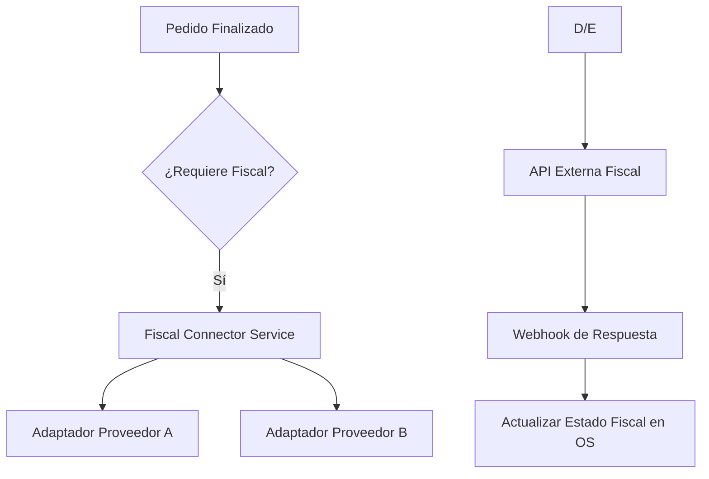

# 📜 Integración Fiscal Futura (FISCAL_INTEGRATION_FUTURE.md)

## 1. Filosofía de Diseño
El Smart Business OS actúa como el **Sistema de Registro Operativo (SSOT)**. La responsabilidad fiscal (firma, validación ante entes tributarios, generación de XML) se delega completamente en proveedores especializados de terceros vía API.

## 2. Modelo de Datos Preparado
Para facilitar esta integración en el futuro, los modelos de pedidos o ventas deben contemplar los siguientes campos (opcionales en el MVP):

| Campo | Tipo | Propósito |
|-------|------|-----------|
| `fiscal_integration_id` | UUID | Referencia al proveedor externo. |
| `external_invoice_id` | String | Número de factura oficial devuelto por el externo. |
| `fiscal_status` | Enum | `PENDING`, `SENT`, `REJECTED`, `SUCCESS`. |
| `fiscal_pdf_url` | String (URL) | Link al documento oficial generado. |
| `fiscal_cufe` | String | Código único de factura electrónica (Latam style). |
| `fiscal_error_message` | Text | Detalle técnico en caso de rechazo del proveedor. |

## 3. Arquitectura del Conector (Conceptual)

## 4. Reglas Operativas
1. **No bloqueante**: Un fallo en el proveedor fiscal no debe borrar el registro operativo en el OS, solo marcarlo con `fiscal_status: REJECTED`.
2. **Logs de Integración**: Se debe registrar el payload exacto enviado y recibido del proveedor externo para soporte técnico.
3. **Idempotencia**: El motor debe evitar enviar dos veces el mismo pedido al proveedor fiscal mediante un bloqueo preventivo basado en el ID del pedido local.
