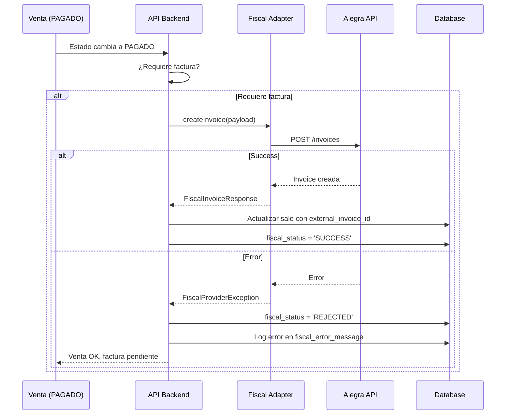

# 🔌 Guía de Integraciones (INTEGRATION_GUIDE.md)

> Documentación completa para integrar proveedores externos: WhatsApp Business API (Meta), Email (Resend), SMS y Proveedores Fiscales.

---

## 📐 1. Principios de Integración

### Reglas de Oro
1. **Desacoplamiento**: El sistema nunca depende de un solo proveedor
2. **Adapter Pattern**: Cada proveedor tiene su propio adaptador
3. **Graceful Degradation**: Si un proveedor falla, el sistema sigue funcionando
4. **Retry Logic**: Reintentos automáticos con exponential backoff
5. **Idempotencia**: Mismo mensaje nunca se envía dos veces

### Arquitectura de Proveedores
```typescript
interface CommunicationProvider {
  name: string;
  send(payload: MessagePayload): Promise<ProviderResponse>;
  validateConfig(): Promise<boolean>;
  getStatus(): ProviderStatus;
}

// Adaptadores implementados
- WhatsAppMetaAdapter
- ResendEmailAdapter
- TwilioSMSAdapter (futuro)
- FiscalProviderAdapter (futuro)
```

---

## 📱 2. WhatsApp Business API (Meta)

### 2.1 Requisitos Previos
1. **Meta Business Account** creada
2. **WhatsApp Business Phone Number** verificado
3. **Permanent Access Token** generado
4. **App ID** y **Phone Number ID** disponibles

### 2.2 Configuración en el Sistema

#### Almacenar Credenciales (Tenant Settings)
```sql
-- Agregar configuración de WhatsApp al tenant
UPDATE tenants
SET branding = jsonb_set(
  branding,
  '{whatsapp}',
  '{
    "provider": "meta",
    "phone_number_id": "1234567890",
    "access_token": "EAAG...encrypted",
    "business_account_id": "9876543210",
    "webhook_verify_token": "random_secure_token",
    "is_active": true
  }'::jsonb
)
WHERE id = 'tenant-uuid';
```

#### Variables de Entorno (.env)
```bash
# Meta WhatsApp
META_API_VERSION=v18.0
META_API_BASE_URL=https://graph.facebook.com
META_WEBHOOK_VERIFY_TOKEN=your_webhook_verify_token_here

# Seguridad
WHATSAPP_ENCRYPTION_KEY=32-character-encryption-key
```

### 2.3 Envío de Mensajes

#### Template Messages (Aprobados por Meta)
```typescript
// Mensaje de Template (VEHICLE_READY)
const sendTemplateMessage = async (
  phoneNumberId: string,
  accessToken: string,
  recipientPhone: string,
  templateName: string,
  languageCode: string,
  components: TemplateComponent[]
) => {
  const url = `https://graph.facebook.com/v18.0/${phoneNumberId}/messages`;
  
  const payload = {
    messaging_product: 'whatsapp',
    to: recipientPhone, // Formato: 573001234567 (sin +)
    type: 'template',
    template: {
      name: templateName, // Ej: 'vehicle_ready'
      language: { code: languageCode }, // Ej: 'es'
      components: components
    }
  };
  
  const response = await fetch(url, {
    method: 'POST',
    headers: {
      'Authorization': `Bearer ${accessToken}`,
      'Content-Type': 'application/json'
    },
    body: JSON.stringify(payload)
  });
  
  return await response.json();
};

// Ejemplo de uso
const components = [
  {
    type: 'body',
    parameters: [
      { type: 'text', text: 'Juan Pérez' }, // {{1}}
      { type: 'text', text: 'Yamaha R1' },  // {{2}}
      { type: 'text', text: 'ABC123' }      // {{3}}
    ]
  }
];
```

#### Mensajes de Texto Libre (Solo 24h después de respuesta del cliente)
```typescript
const sendTextMessage = async (
  phoneNumberId: string,
  accessToken: string,
  recipientPhone: string,
  message: string
) => {
  const url = `https://graph.facebook.com/v18.0/${phoneNumberId}/messages`;
  
  const payload = {
    messaging_product: 'whatsapp',
    to: recipientPhone,
    type: 'text',
    text: { body: message }
  };
  
  const response = await fetch(url, {
    method: 'POST',
    headers: {
      'Authorization': `Bearer ${accessToken}`,
      'Content-Type': 'application/json'
    },
    body: JSON.stringify(payload)
  });
  
  return await response.json();
};
```

### 2.4 Webhooks de Meta

#### Configurar Webhook en Meta Business Manager
```
Callback URL: https://api.smartbusiness.com/api/v1/webhooks/whatsapp
Verify Token: your_webhook_verify_token_here
Webhook Fields: messages, message_status
```

#### Endpoint de Verificación (GET)
```typescript
// NestJS Controller
@Get('webhooks/whatsapp')
verifyWebhook(@Query() query: any) {
  const mode = query['hub.mode'];
  const token = query['hub.verify_token'];
  const challenge = query['hub.challenge'];
  
  if (mode === 'subscribe' && token === process.env.META_WEBHOOK_VERIFY_TOKEN) {
    return challenge; // Devolver el challenge tal cual
  }
  
  throw new ForbiddenException('Invalid verification token');
}
```

#### Endpoint de Recepción (POST)
```typescript
@Post('webhooks/whatsapp')
async handleWhatsAppWebhook(@Body() body: any, @Headers() headers: any) {
  // 1. Verificar firma de Meta
  const signature = headers['x-hub-signature-256'];
  const isValid = this.verifyMetaSignature(body, signature);
  
  if (!isValid) {
    throw new ForbiddenException('Invalid signature');
  }
  
  // 2. Procesar eventos
  for (const entry of body.entry) {
    for (const change of entry.changes) {
      const value = change.value;
      
      // Estado de mensaje enviado
      if (value.statuses) {
        for (const status of value.statuses) {
          await this.updateMessageStatus({
            external_id: status.id,
            status: status.status, // sent, delivered, read, failed
            timestamp: status.timestamp,
            error: status.errors?.[0]
          });
        }
      }
      
      // Mensaje entrante del cliente (respuesta)
      if (value.messages) {
        for (const message of value.messages) {
          await this.handleIncomingMessage({
            from: message.from,
            message_id: message.id,
            timestamp: message.timestamp,
            text: message.text?.body,
            type: message.type
          });
        }
      }
    }
  }
  
  return { success: true };
}
```

### 2.5 Plantillas de WhatsApp (Registro en Meta)

#### Template: vehicle_ready
```
Nombre: vehicle_ready
Categoría: UTILITY
Idioma: es
Contenido:
Hola {{1}}, tu {{2}} {{3}} ({{4}}) ya está listo para ser retirado en {{5}}. Costo final: ${{6}}. Horario: Lunes a Sábado, 8am - 6pm.

Botones:
[Confirmar Retiro] [Cancelar]
```

#### Template: stock_critical_alert
```
Nombre: stock_critical_alert
Categoría: UTILITY
Idioma: es
Contenido:
⚠️ Alerta: El producto {{1}} (SKU: {{2}}) tiene stock crítico: {{3}} unidades. Revisa tu inventario en {{4}}.
```

### 2.6 Rate Limits de Meta
| Tier | Límite Diario | Límite por Segundo |
|------|--------------|-------------------|
| Tier 1 | 1,000 mensajes | 80 mensajes/s |
| Tier 2 | 10,000 mensajes | 80 mensajes/s |
| Tier Unlimited | Ilimitado | 200 mensajes/s |

**Manejo en el sistema:**
```typescript
// Implementar rate limiting interno
const WHATSAPP_RATE_LIMIT = {
  max_per_second: 50, // Debajo del límite de Meta
  max_per_day: 800    // Debajo del tier inicial
};

// Queue con Bull
import { Queue } from 'bull';

const whatsappQueue = new Queue('whatsapp-messages', {
  limiter: {
    max: 50,
    duration: 1000 // 50 mensajes por segundo
  }
});
```

### 2.7 Códigos de Error de Meta
| Código | Descripción | Acción |
|--------|-------------|--------|
| 131026 | Message Undeliverable (número inválido) | Marcar como FAILED, no reintentar |
| 131047 | Re-engagement message | Usuario debe escribir primero |
| 130472 | User's number is part of an experiment | Reintentar en 24h |
| 133016 | Rate limit hit | Esperar y reintentar con backoff |

---

## 📧 3. Email (Resend)

### 3.1 Requisitos Previos
1. **Cuenta en Resend** creada
2. **Dominio verificado** (ej: noreply@smartbusiness.com)
3. **API Key** generada

### 3.2 Configuración

#### Variables de Entorno
```bash
RESEND_API_KEY=re_abc123...
RESEND_FROM_EMAIL=noreply@smartbusiness.com
RESEND_FROM_NAME=Smart Business OS
```

#### Almacenar en Tenant (Opcional - Email personalizado)
```sql
UPDATE tenants
SET branding = jsonb_set(
  branding,
  '{email}',
  '{
    "provider": "resend",
    "from_email": "contacto@miempresa.com",
    "from_name": "Mi Empresa",
    "is_active": true
  }'::jsonb
)
WHERE id = 'tenant-uuid';
```

### 3.3 Envío de Emails

#### Email Transaccional Simple
```typescript
import { Resend } from 'resend';

const resend = new Resend(process.env.RESEND_API_KEY);

const sendEmail = async (payload: EmailPayload) => {
  const result = await resend.emails.send({
    from: `${process.env.RESEND_FROM_NAME} <${process.env.RESEND_FROM_EMAIL}>`,
    to: payload.recipient,
    subject: payload.subject,
    html: payload.html,
    text: payload.text, // Fallback texto plano
    tags: [
      { name: 'tenant_id', value: payload.tenantId },
      { name: 'automation_id', value: payload.automationId }
    ]
  });
  
  return result;
};

// Ejemplo de uso
await sendEmail({
  recipient: 'juan.perez@example.com',
  subject: 'Tu vehículo está listo',
  html: `
    <h1>Hola Juan Pérez</h1>
    <p>Tu Yamaha R1 (ABC123) ya está listo para ser retirado.</p>
    <p>Costo final: $200,000</p>
  `,
  text: 'Hola Juan Pérez, tu Yamaha R1 (ABC123) ya está listo...',
  tenantId: 'uuid',
  automationId: 'uuid'
});
```

#### Email con Template React
```tsx
// emails/VehicleReady.tsx
import { Html, Head, Body, Container, Heading, Text } from '@react-email/components';

interface VehicleReadyProps {
  customerName: string;
  vehicleBrand: string;
  vehicleModel: string;
  vehiclePlate: string;
  totalCost: number;
  businessName: string;
}

export const VehicleReady = ({
  customerName,
  vehicleBrand,
  vehicleModel,
  vehiclePlate,
  totalCost,
  businessName
}: VehicleReadyProps) => (
  <Html>
    <Head />
    <Body style={{ backgroundColor: '#f6f9fc' }}>
      <Container style={{ padding: '40px' }}>
        <Heading>¡Tu vehículo está listo!</Heading>
        <Text>Hola {customerName},</Text>
        <Text>
          Tu {vehicleBrand} {vehicleModel} ({vehiclePlate}) ya está listo 
          para ser retirado en {businessName}.
        </Text>
        <Text style={{ fontWeight: 'bold' }}>
          Costo final: ${totalCost.toLocaleString('es-CO')}
        </Text>
        <Text>Horario: Lunes a Sábado, 8am - 6pm.</Text>
      </Container>
    </Body>
  </Html>
);

// Uso en el servicio
import { render } from '@react-email/render';
import { VehicleReady } from './emails/VehicleReady';

const html = render(<VehicleReady {...props} />);
await sendEmail({ html, ... });
```

### 3.4 Webhooks de Resend

#### Configurar Webhook en Resend Dashboard
```
Endpoint: https://api.smartbusiness.com/api/v1/webhooks/resend
Events: email.sent, email.delivered, email.bounced, email.complained
```

#### Endpoint de Recepción
```typescript
@Post('webhooks/resend')
async handleResendWebhook(@Body() body: any, @Headers() headers: any) {
  // Verificar firma
  const signature = headers['svix-signature'];
  const isValid = this.verifyResendSignature(body, signature);
  
  if (!isValid) {
    throw new ForbiddenException('Invalid signature');
  }
  
  // Procesar evento
  const { type, data } = body;
  
  switch (type) {
    case 'email.sent':
      await this.updateEmailStatus(data.email_id, 'SENT');
      break;
    case 'email.delivered':
      await this.updateEmailStatus(data.email_id, 'DELIVERED');
      break;
    case 'email.bounced':
      await this.handleEmailBounce(data);
      break;
    case 'email.complained':
      await this.handleSpamComplaint(data);
      break;
  }
  
  return { success: true };
}
```

### 3.5 Rate Limits de Resend
- **Free Plan**: 100 emails/día
- **Pro Plan**: 50,000 emails/mes
- **No hay límite por segundo** (razonable)

---

## 💳 4. Proveedores Fiscales (Futuro)

### 4.1 Arquitectura del Conector

```typescript
interface FiscalProvider {
  name: string; // 'alegra', 'siigo', 'ublcolombia'
  country: string; // 'CO', 'MX', 'PE'
  
  // Métodos obligatorios
  createInvoice(invoice: InvoicePayload): Promise<FiscalInvoiceResponse>;
  getInvoiceStatus(externalId: string): Promise<InvoiceStatus>;
  downloadPDF(externalId: string): Promise<Buffer>;
  cancelInvoice(externalId: string, reason: string): Promise<void>;
}

// Ejemplo de payload
interface InvoicePayload {
  // Datos del emisor (tenant)
  issuer: {
    name: string;
    tax_id: string; // NIT en Colombia
    address: string;
  };
  
  // Datos del receptor (cliente)
  recipient: {
    name: string;
    tax_id: string;
    email: string;
    address: string;
  };
  
  // Items de la venta
  items: Array<{
    description: string;
    quantity: number;
    unit_price: number;
    tax_rate: number; // 0.19 para IVA 19%
  }>;
  
  // Totales
  subtotal: number;
  tax: number;
  total: number;
  
  // Metadatos
  payment_method: string;
  currency: string; // 'COP'
  issue_date: string; // ISO 8601
}
```

### 4.2 Adaptador de Ejemplo (Alegra)

```typescript
class AlegraFiscalAdapter implements FiscalProvider {
  name = 'alegra';
  country = 'CO';
  
  constructor(
    private apiKey: string,
    private apiSecret: string,
    private baseUrl = 'https://api.alegra.com/api/v1'
  ) {}
  
  async createInvoice(payload: InvoicePayload): Promise<FiscalInvoiceResponse> {
    // 1. Mapear payload a formato de Alegra
    const alegraPayload = this.mapToAlegraFormat(payload);
    
    // 2. Enviar a Alegra
    const response = await fetch(`${this.baseUrl}/invoices`, {
      method: 'POST',
      headers: {
        'Authorization': `Basic ${btoa(`${this.apiKey}:${this.apiSecret}`)}`,
        'Content-Type': 'application/json'
      },
      body: JSON.stringify(alegraPayload)
    });
    
    const data = await response.json();
    
    if (!response.ok) {
      throw new FiscalProviderException({
        provider: 'alegra',
        error: data.message,
        code: data.code
      });
    }
    
    // 3. Retornar respuesta normalizada
    return {
      external_id: data.id.toString(),
      invoice_number: data.numberTemplate.fullNumber,
      cufe: data.stamp?.cufe, // Código único de factura electrónica
      pdf_url: data.pdf,
      xml_url: data.xml,
      status: this.mapAlegraStatus(data.status),
      created_at: new Date(data.date)
    };
  }
  
  private mapToAlegraFormat(payload: InvoicePayload) {
    return {
      date: payload.issue_date,
      client: {
        name: payload.recipient.name,
        identification: payload.recipient.tax_id,
        email: payload.recipient.email,
        address: { address: payload.recipient.address }
      },
      items: payload.items.map(item => ({
        name: item.description,
        quantity: item.quantity,
        price: item.unit_price,
        tax: [{
          id: 1, // IVA
          percentage: item.tax_rate * 100
        }]
      })),
      observations: 'Factura generada automáticamente desde Smart Business OS'
    };
  }
}
```

### 4.3 Flujo de Facturación



### 4.4 Campos de Base de Datos para Fiscal

```sql
-- Agregar a tabla sales
ALTER TABLE sales
ADD COLUMN requires_invoice BOOLEAN DEFAULT FALSE,
ADD COLUMN fiscal_integration_id UUID, -- Referencia al proveedor fiscal
ADD COLUMN external_invoice_id VARCHAR(255),
ADD COLUMN fiscal_status VARCHAR(50) 
  CHECK (fiscal_status IN ('PENDING', 'SENT', 'REJECTED', 'SUCCESS')),
ADD COLUMN fiscal_pdf_url TEXT,
ADD COLUMN fiscal_xml_url TEXT,
ADD COLUMN fiscal_cufe VARCHAR(255),
ADD COLUMN fiscal_error_message TEXT;
```

---

## 🔄 5. Sistema de Reintentos (Retry Logic)

### 5.1 Estrategia de Backoff Exponencial

```typescript
const retry = async <T>(
  fn: () => Promise<T>,
  maxRetries = 3,
  initialDelay = 1000
): Promise<T> => {
  let lastError: Error;
  
  for (let attempt = 0; attempt < maxRetries; attempt++) {
    try {
      return await fn();
    } catch (error) {
      lastError = error;
      
      // No reintentar si es error de validación
      if (error.code === 'VALIDATION_ERROR') {
        throw error;
      }
      
      // Calcular delay exponencial: 1s, 2s, 4s
      const delay = initialDelay * Math.pow(2, attempt);
      await sleep(delay);
    }
  }
  
  throw lastError;
};

// Uso
await retry(() => whatsappAdapter.send(payload), 3, 1000);
```

### 5.2 Dead Letter Queue (DLQ)

```typescript
// Mensajes que fallaron después de todos los reintentos
const moveToDeadLetterQueue = async (execution: AutomationExecution) => {
  await db.automation_executions.update(execution.id, {
    status: 'FAILED',
    retry_count: execution.retry_count,
    error_message: execution.error_message
  });
  
  // Alertar al admin si es crítico
  if (execution.automation.template.priority === 'CRITICAL') {
    await sendAdminAlert({
      severity: 'HIGH',
      message: `Automatización crítica falló: ${execution.automation.template.name}`,
      automation_id: execution.automation_id,
      error: execution.error_message
    });
  }
};
```

---

## 🔐 6. Seguridad de Integraciones

### 6.1 Encriptación de Tokens

```typescript
import crypto from 'crypto';

const ENCRYPTION_KEY = process.env.INTEGRATION_ENCRYPTION_KEY; // 32 bytes
const ALGORITHM = 'aes-256-gcm';

export const encrypt = (text: string): string => {
  const iv = crypto.randomBytes(16);
  const cipher = crypto.createCipheriv(ALGORITHM, Buffer.from(ENCRYPTION_KEY, 'hex'), iv);
  
  let encrypted = cipher.update(text, 'utf8', 'hex');
  encrypted += cipher.final('hex');
  
  const authTag = cipher.getAuthTag().toString('hex');
  
  return `${iv.toString('hex')}:${authTag}:${encrypted}`;
};

export const decrypt = (encryptedText: string): string => {
  const [iv, authTag, encrypted] = encryptedText.split(':');
  
  const decipher = crypto.createDecipheriv(
    ALGORITHM,
    Buffer.from(ENCRYPTION_KEY, 'hex'),
    Buffer.from(iv, 'hex')
  );
  
  decipher.setAuthTag(Buffer.from(authTag, 'hex'));
  
  let decrypted = decipher.update(encrypted, 'hex', 'utf8');
  decrypted += decipher.final('utf8');
  
  return decrypted;
};
```

### 6.2 Verificación de Webhooks

#### Meta WhatsApp
```typescript
import crypto from 'crypto';

const verifyMetaSignature = (body: any, signature: string): boolean => {
  const expectedSignature = crypto
    .createHmac('sha256', process.env.META_APP_SECRET)
    .update(JSON.stringify(body))
    .digest('hex');
  
  return signature === `sha256=${expectedSignature}`;
};
```

#### Resend (Svix)
```typescript
import { Webhook } from 'svix';

const verifyResendSignature = (body: any, headers: any): boolean => {
  const wh = new Webhook(process.env.RESEND_WEBHOOK_SECRET);
  
  try {
    wh.verify(JSON.stringify(body), headers);
    return true;
  } catch (err) {
    return false;
  }
};
```

---

## 📊 7. Monitoreo de Integraciones

### 7.1 Dashboard de Health Check

```typescript
interface IntegrationHealth {
  provider: string;
  status: 'healthy' | 'degraded' | 'down';
  last_successful_request: Date;
  error_rate_24h: number;
  avg_response_time: number;
}

// Endpoint de monitoreo
@Get('integrations/health')
async getIntegrationsHealth(): Promise<IntegrationHealth[]> {
  return [
    await this.checkWhatsAppHealth(),
    await this.checkResendHealth(),
    await this.checkFiscalHealth()
  ];
}

const checkWhatsAppHealth = async (): Promise<IntegrationHealth> => {
  const last24h = await db.automation_executions.findMany({
    where: {
      channel: 'whatsapp',
      executed_at: { gte: new Date(Date.now() - 24 * 60 * 60 * 1000) }
    }
  });
  
  const failed = last24h.filter(e => e.status === 'FAILED').length;
  const errorRate = failed / last24h.length;
  
  return {
    provider: 'whatsapp_meta',
    status: errorRate > 0.1 ? 'degraded' : 'healthy',
    last_successful_request: last24h[0]?.executed_at,
    error_rate_24h: errorRate,
    avg_response_time: 0 // Calcular promedio
  };
};
```

---

## 📚 Referencias

### Documentación Oficial
- **Meta WhatsApp Business API**: https://developers.facebook.com/docs/whatsapp/business-platform
- **Resend**: https://resend.com/docs
- **Alegra API**: https://developer.alegra.com/docs
- **Siigo API**: https://siigoapi.docs.apiary.io

### Herramientas de Testing
- **WhatsApp Sandbox**: Para desarrollo sin número real
- **Resend Test Mode**: Emails no se envían realmente
- **Postman Collections**: Disponibles para cada proveedor

---

**Estado**: ✅ **Guía de Integraciones Completa**  
**Versión**: 1.0.0  
**Última Actualización**: 2026-02-13  
**Mantenedor**: Smart Business OS Core Team
